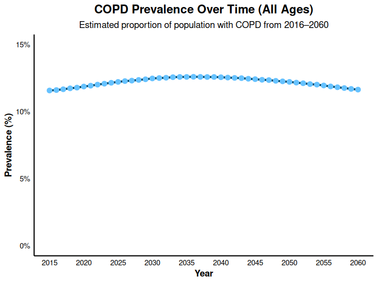
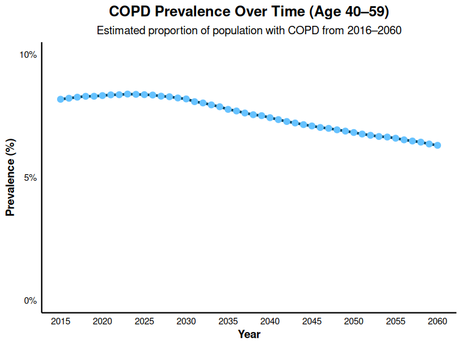
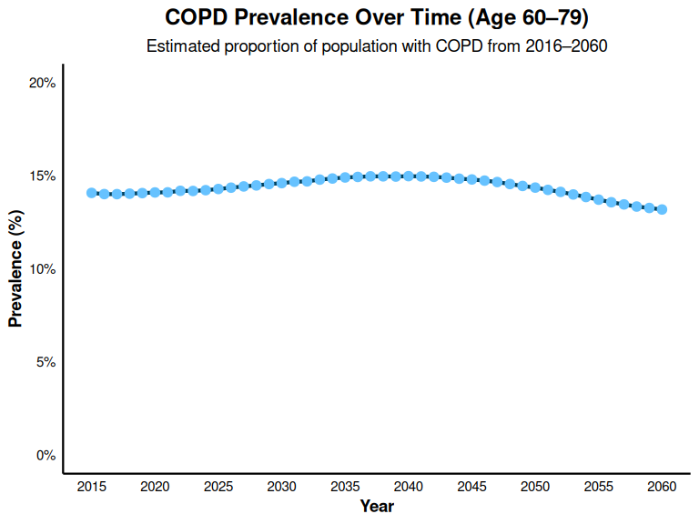
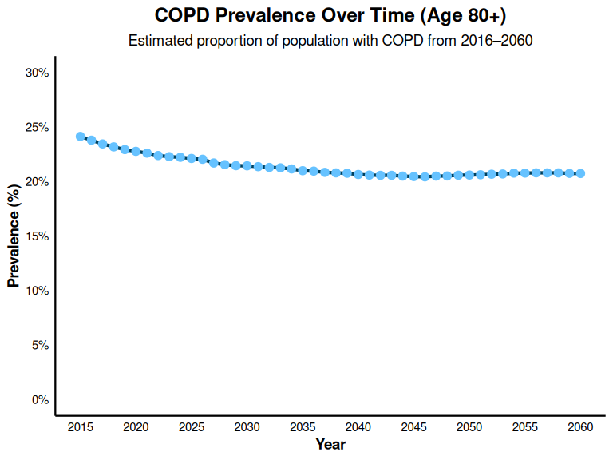
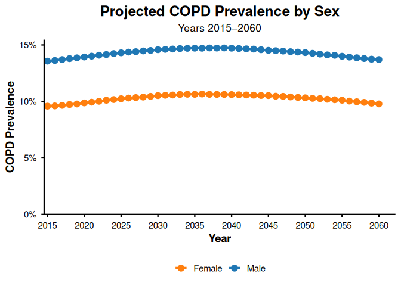

COPD Occurrence Module
================

## Overview

This document outlines the calibration process undertaken to align the
model’s outputs with U.S.-based validation targets for COPD prevalence,
using NHANES data in which COPD was defined according to the Lower Limit
of Normal (LLN) definition. The calibration was conducted over a 45-year
simulation time horizon.

**Validation Reference:**  
Tilert et al. 2013 (DOI: 10.1186/1465-9921-14-103)

**Validation Target (Age-Specific Prevalence):**  
- **40–59 years:** 8.1%  
- **60–79 years:** 14.4%

**Validation Target (Sex-Specific Prevalence):**  
- **Males:** 12.0%  
- **Females:** 8.6%

It is important to note that the EPIC model simulates individuals aged
40 and older, including those ≥80 years, whereas Tilert et al. 2013
included only individuals aged 40–79.

Given this limitation, the calibration emphasized preserving the
sex-specific prevalence ratio observed in Tilert et al. 2013 (1.4:1;
12.0% males vs. 8.6% females) as the validation target. The model was
deemed adequately calibrated if this ratio was maintained, even if
absolute prevalence values by sex differed slightly due to inclusion of
older age groups.

**Evolution of LLN Reference Equations and Impact on COPD Prevalence
Estimation**

Reference equations used to define the LLN for spirometry to diagnose
COPD have evolved over time, moving from race-specific models toward
more inclusive, race-neutral approaches. Tilert et al. 2013 defined COPD
using LLN values derived from the Hankinson equation, a race-specific
model widely used in earlier guidelines. In contrast, current guidelines
recommend using the Global Lung Function Initiative (GLI) race-neutral
reference equations. A recent analysis by Cadham et al. 2024 (DOI:
10.1186/s12931-024-02841-y) compared COPD prevalence estimates based on
the Hankinson and GLI race-neutral equations and found no significant
differences between the two approaches.

## Load Libraries and Setup

Here, we load the necessary libraries. The simulation settings is set
and the time horizon specified for the simulation is 45 years.

``` r
library(epicUS)
library(tidyverse)
library(ggplot2)
library(dplyr)
library(knitr)

# Load EPIC general settings
settings <- get_default_settings()
settings$record_mode <- 0
settings$n_base_agents <- 1e6
init_session(settings = settings)
```

    ## [1] 0

``` r
input <- get_input()
time_horizon <- 46
input$values$global_parameters$time_horizon <- time_horizon

# Run EPIC simulation
run(input = input$values)
```

    ## [1] 0

``` r
output <- Cget_output_ex()
terminate_session()
```

    ## [1] 0

## Create Data Tables by Age Category

``` r
# Determine overall COPD prevalence

COPDprevalence_ctime_age<-output$n_COPD_by_ctime_age
COPDprevalence_ctime_age<-as.data.frame(output$n_COPD_by_ctime_age)
totalpopulation<-output$n_alive_by_ctime_age

# Overall prevalence of COPD

alive_age_all <- rowSums(output$n_alive_by_ctime_age[1:46, 40:111])
COPD_age_all <- rowSums (output$n_COPD_by_ctime_age[1:46, 40:111])
prevalenceCOPD_age_all <- COPD_age_all / alive_age_all

# Prevalence by age 40-59 

alive_age_40to59 <- rowSums(output$n_alive_by_ctime_age[1:46, 40:59])
COPD_age_40to59 <-rowSums(output$n_COPD_by_ctime_age[1:46, 40:59])
prevalenceCOPD_age_40to59 <- COPD_age_40to59 / alive_age_40to59

# Prevalence by age 60-79

alive_age_60to79 <- rowSums(output$n_alive_by_ctime_age[1:46, 60:79])
COPD_age_60to79 <-rowSums(output$n_COPD_by_ctime_age[1:46, 60:79])
prevalenceCOPD_age_60to79 <- COPD_age_60to79 / alive_age_60to79

# Prevalence by age 80+

alive_age_over80 <- rowSums(output$n_alive_by_ctime_age[1:46, 80:111])
COPD_age_over80 <-rowSums(output$n_COPD_by_ctime_age[1:46, 80:111])
prevalenceCOPD_age_over80 <- COPD_age_over80 / alive_age_over80

# Display summary of COPD prevalence by age group 

COPD_prevalence_summary <- data.frame(
  Year = 2015:2060,
  Prevalence_all = prevalenceCOPD_age_all,
  Prevalence_40to59 = prevalenceCOPD_age_40to59,
  Prevalence_60to79 = prevalenceCOPD_age_60to79,
  Prevalence_over80 = prevalenceCOPD_age_over80
  )

kable(COPD_prevalence_summary, 
      caption = "COPD Prevalence by Age Group Over Time",
      digits = 3)
```

| Year | Prevalence_all | Prevalence_40to59 | Prevalence_60to79 | Prevalence_over80 |
|-----:|---------------:|------------------:|------------------:|------------------:|
| 2015 |          0.116 |             0.082 |             0.141 |             0.241 |
| 2016 |          0.116 |             0.082 |             0.140 |             0.238 |
| 2017 |          0.117 |             0.083 |             0.140 |             0.234 |
| 2018 |          0.117 |             0.083 |             0.140 |             0.232 |
| 2019 |          0.118 |             0.083 |             0.141 |             0.229 |
| 2020 |          0.119 |             0.083 |             0.141 |             0.228 |
| 2021 |          0.119 |             0.084 |             0.141 |             0.226 |
| 2022 |          0.120 |             0.084 |             0.142 |             0.224 |
| 2023 |          0.121 |             0.084 |             0.142 |             0.223 |
| 2024 |          0.122 |             0.084 |             0.142 |             0.222 |
| 2025 |          0.122 |             0.084 |             0.143 |             0.221 |
| 2026 |          0.123 |             0.084 |             0.144 |             0.220 |
| 2027 |          0.123 |             0.083 |             0.144 |             0.217 |
| 2028 |          0.124 |             0.083 |             0.145 |             0.215 |
| 2029 |          0.124 |             0.082 |             0.145 |             0.214 |
| 2030 |          0.125 |             0.082 |             0.146 |             0.214 |
| 2031 |          0.125 |             0.081 |             0.147 |             0.214 |
| 2032 |          0.125 |             0.080 |             0.147 |             0.213 |
| 2033 |          0.126 |             0.080 |             0.148 |             0.212 |
| 2034 |          0.126 |             0.079 |             0.148 |             0.211 |
| 2035 |          0.126 |             0.078 |             0.149 |             0.210 |
| 2036 |          0.126 |             0.077 |             0.149 |             0.209 |
| 2037 |          0.126 |             0.076 |             0.150 |             0.208 |
| 2038 |          0.126 |             0.076 |             0.150 |             0.208 |
| 2039 |          0.126 |             0.075 |             0.150 |             0.207 |
| 2040 |          0.126 |             0.074 |             0.150 |             0.206 |
| 2041 |          0.125 |             0.074 |             0.150 |             0.206 |
| 2042 |          0.125 |             0.073 |             0.149 |             0.206 |
| 2043 |          0.125 |             0.072 |             0.149 |             0.206 |
| 2044 |          0.125 |             0.071 |             0.148 |             0.205 |
| 2045 |          0.124 |             0.071 |             0.148 |             0.204 |
| 2046 |          0.124 |             0.070 |             0.147 |             0.204 |
| 2047 |          0.124 |             0.070 |             0.147 |             0.205 |
| 2048 |          0.123 |             0.069 |             0.145 |             0.205 |
| 2049 |          0.123 |             0.069 |             0.144 |             0.206 |
| 2050 |          0.122 |             0.068 |             0.144 |             0.206 |
| 2051 |          0.122 |             0.068 |             0.142 |             0.206 |
| 2052 |          0.121 |             0.067 |             0.141 |             0.207 |
| 2053 |          0.121 |             0.067 |             0.140 |             0.207 |
| 2054 |          0.120 |             0.066 |             0.139 |             0.208 |
| 2055 |          0.120 |             0.066 |             0.137 |             0.208 |
| 2056 |          0.119 |             0.065 |             0.136 |             0.208 |
| 2057 |          0.118 |             0.065 |             0.135 |             0.208 |
| 2058 |          0.118 |             0.064 |             0.133 |             0.208 |
| 2059 |          0.117 |             0.064 |             0.133 |             0.207 |
| 2060 |          0.116 |             0.063 |             0.132 |             0.207 |

COPD Prevalence by Age Group Over Time

## Visualize Smoking Trends by Age Category

### COPD Prevalence for All Age Groups

<!-- -->

### COPD Prevalence from Age 40 to 59

<!-- -->

### COPD Prevalence from Age 60 to 79

<!-- -->

**COPD Prevalence for Age 80+**

<!-- -->

## Create Data Tables by Sex

``` r
# Calculate COPD prevalence by sex over time

alive_sex <- output$n_alive_by_ctime_sex
COPD_sex <- output$n_COPD_by_ctime_sex
prevalenceCOPD_sex <- COPD_sex / alive_sex
prevalenceCOPD_sex<-as.data.frame (prevalenceCOPD_sex)

# Rename columns
colnames(prevalenceCOPD_sex) <- c("Male", "Female")
prevalenceCOPD_sex$Year <- 2015:2060


# Display summary of COPD prevalence by sex

kable(prevalenceCOPD_sex,
  caption = "COPD Prevalence by Sex Over Time",
  digits = 3
)
```

|  Male | Female | Year |
|------:|-------:|-----:|
| 0.136 |  0.096 | 2015 |
| 0.136 |  0.096 | 2016 |
| 0.137 |  0.097 | 2017 |
| 0.138 |  0.097 | 2018 |
| 0.139 |  0.098 | 2019 |
| 0.139 |  0.099 | 2020 |
| 0.140 |  0.099 | 2021 |
| 0.141 |  0.100 | 2022 |
| 0.141 |  0.101 | 2023 |
| 0.142 |  0.102 | 2024 |
| 0.143 |  0.102 | 2025 |
| 0.144 |  0.103 | 2026 |
| 0.144 |  0.103 | 2027 |
| 0.145 |  0.104 | 2028 |
| 0.145 |  0.104 | 2029 |
| 0.146 |  0.105 | 2030 |
| 0.146 |  0.105 | 2031 |
| 0.146 |  0.106 | 2032 |
| 0.147 |  0.106 | 2033 |
| 0.147 |  0.106 | 2034 |
| 0.147 |  0.106 | 2035 |
| 0.147 |  0.107 | 2036 |
| 0.147 |  0.106 | 2037 |
| 0.147 |  0.106 | 2038 |
| 0.147 |  0.106 | 2039 |
| 0.147 |  0.106 | 2040 |
| 0.147 |  0.106 | 2041 |
| 0.147 |  0.106 | 2042 |
| 0.146 |  0.106 | 2043 |
| 0.146 |  0.105 | 2044 |
| 0.145 |  0.105 | 2045 |
| 0.145 |  0.105 | 2046 |
| 0.145 |  0.105 | 2047 |
| 0.144 |  0.104 | 2048 |
| 0.144 |  0.104 | 2049 |
| 0.143 |  0.103 | 2050 |
| 0.143 |  0.103 | 2051 |
| 0.142 |  0.102 | 2052 |
| 0.141 |  0.102 | 2053 |
| 0.141 |  0.101 | 2054 |
| 0.140 |  0.101 | 2055 |
| 0.139 |  0.100 | 2056 |
| 0.139 |  0.100 | 2057 |
| 0.138 |  0.099 | 2058 |
| 0.137 |  0.098 | 2059 |
| 0.137 |  0.098 | 2060 |

COPD Prevalence by Sex Over Time

## Visualize COPD Prevalence by Sex

``` r
# Define the consistent color scheme
sex_colors <- c("Male" = "#1f77b4",   # Blue
                "Female" = "#ff7f0e") # Orange

# Pivot data to long format for ggplot
prevalence_long <- prevalenceCOPD_sex %>%
  pivot_longer(
    cols = c("Male", "Female"),
    names_to = "Sex",
    values_to = "Prevalence"
  )

# Create the plot
p_prevalence <- ggplot(prevalence_long, aes(x = Year, y = Prevalence, color = Sex)) +
  geom_line(linewidth = 1.5) +
  geom_point(size = 3, stroke = 0.8) +
  
  # Apply the custom colors
  scale_color_manual(values = sex_colors) +
  
  # Format Y axis as Percentage (0.1 -> 10%)
  scale_y_continuous(
    name = "COPD Prevalence",
    labels = scales::percent_format(accuracy = 1), 
    limits = c(0, NA),
    expand = expansion(mult = c(0, 0.05))
  ) +
  
  scale_x_continuous(
    name = "Year",
    breaks = seq(2015, 2060, by = 5),
    expand = expansion(mult = c(0.01, 0.05))
  ) +
  
  labs(
    title = "Projected COPD Prevalence by Sex",
    subtitle = "Years 2015–2060"
  ) +
  
  theme_minimal(base_size = 14) +
  theme(
    plot.title    = element_text(face = "bold", size = 18, hjust = 0.5, margin = margin(b = 6)),
    plot.subtitle = element_text(size = 13, hjust = 0.5),
    axis.title    = element_text(face = "bold"),
    axis.text     = element_text(color = "black"),
    legend.position = "bottom",
    legend.title    = element_blank(),
    panel.grid.major = element_blank(),
    panel.grid.minor = element_blank(),
    axis.line       = element_line(color = "black", linewidth = 0.8),
    axis.ticks      = element_line(color = "black", linewidth = 0.8)
  )

print(p_prevalence)
```

<!-- -->
