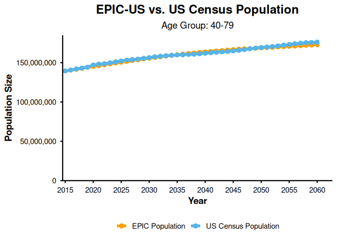
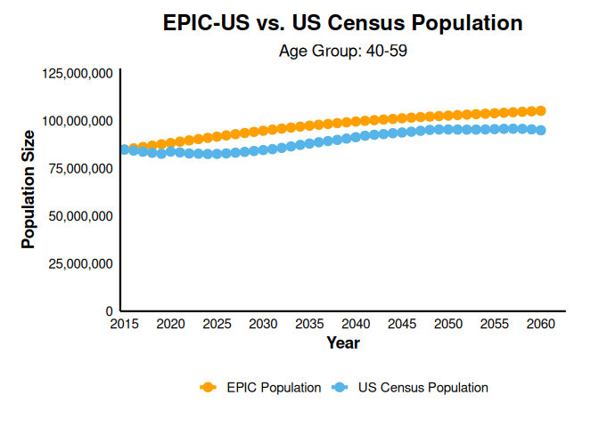
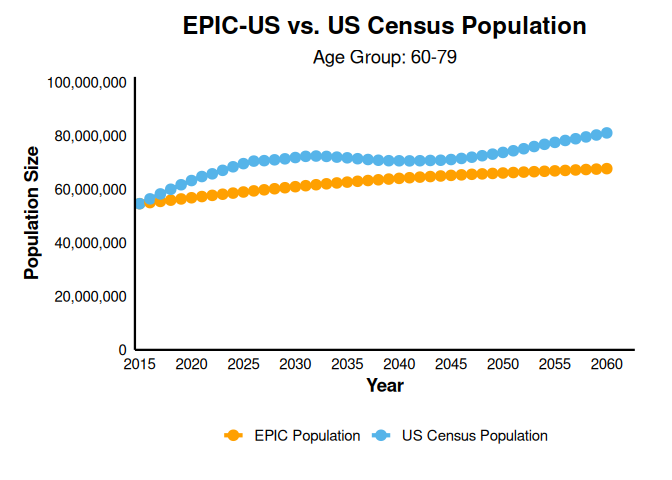
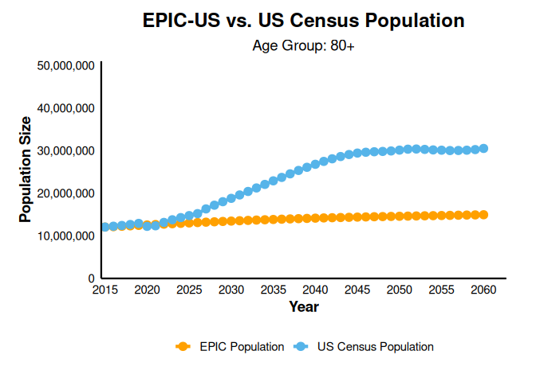
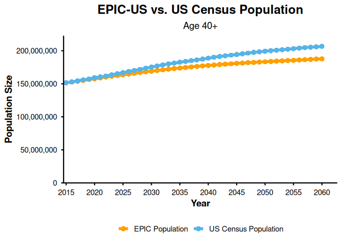

Demographics Module
================

## Overview

This document outlines the validation process to align the EPIC model’s
population size outputs with U.S. Census population size projections
across different age strata to better predict age demographics. The
validation was conducted over a 45-year simulation time horizon
(2015–2060).

**Validation Reference:** U.S. Census Population

**Validation Targets (Population Size by Age Groups)**: Age 40–79, Age
40–59, Age 60–79, Age 80+, Age 40+

## Load libraries and setup

Here, we load the necessary libraries, configure the default simulation
settings, and set the simulation time horizon to 46 years (to cover up
to 2060).

``` r
library(epicUS)
library(tidyverse)
library(ggplot2)
library(scales)
library(ggthemes)
library(dplyr)
library(tidyr)
library(knitr)

# Load US population validation targets
filelocation<- system.file("USCensus.csv", package = "epicUS")
USSimulation <- read_csv(filelocation)

# Load EPIC and configure settings
settings <- get_default_settings()
settings$record_mode <- 0
settings$n_base_agents <- 1e6
init_session(settings = settings)
```

    ## [1] 0

``` r
input <- get_input()
time_horizon <- 46
input$values$global_parameters$time_horizon <- time_horizon

# Run EPIC simulation
run(input = input$values)
```

    ## [1] 0

``` r
output <- Cget_output_ex()
terminate_session()
```

    ## [1] 0

## Data preparation

To compare the population size, we extract the total alive individuals
by year and age, map them to the 2015 U.S. Census baseline, and apply
the model’s simulated growth rate to project absolute population
estimates

``` r
# Get EPIC-US population size by age and time
epic_popsize_age <- data.frame(
  year = seq(2015, by = 1, length.out = length(output$n_alive_by_ctime_age[,1])),
  output$n_alive_by_ctime_age
)

# Rename columns to ages (first column is year)
colnames(epic_popsize_age)[2:ncol(epic_popsize_age)] <- 1:(ncol(epic_popsize_age) - 1)

# Remove ages 0-39 (Columns 2-40) to align with USSimulation 40+ data
if(ncol(epic_popsize_age) > 40) {
  epic_popsize_age <- epic_popsize_age[, -(2:40)]
}

epic_popsize_age_long <- epic_popsize_age %>%
  pivot_longer(!year, names_to = "age", values_to = "EPIC_popsize") %>%
  mutate(age = as.integer(age))

# Join with USSimulation and calculate growth rates
validate_pop_size_scaled <- USSimulation %>%
  rename(US_popsize = value) %>%
  left_join(epic_popsize_age_long, by = c("year", "age"))

total_epic_by_year <- validate_pop_size_scaled %>%
  group_by(year) %>%
  summarise(total_EPIC_output = sum(EPIC_popsize, na.rm = TRUE), .groups = "drop") %>%
  arrange(year) %>%
  mutate(growth_rate = total_EPIC_output / lag(total_EPIC_output))

# Scale EPIC outputs
df_with_growth <- validate_pop_size_scaled %>%
  left_join(total_epic_by_year, by = "year") %>%
  arrange(year, age) %>%
  group_by(age) %>%
  mutate(
    EPIC_output_scaled = ifelse(year == 2015, US_popsize, NA),
    EPIC_output_scaled = replace_na(EPIC_output_scaled, first(US_popsize)) *
      cumprod(replace_na(growth_rate, 1))
  ) %>%
  ungroup()

# Set colours for plots
poster_colors <- c(
  "total_EPIC_population" = "#FFA000",  # Gold/Orange
  "total_US_population"   = "#56B4E9"   # Light Blue
)
```

## Compare EPIC-US and U.S Census Projections

### Age 40-79 EPIC-US vs. US Census Population

``` r
df_40to79_long <- df_with_growth %>%
  filter(age >= 40 & age <= 79) %>%
  group_by(year) %>%
  summarise(
    total_EPIC_population = sum(EPIC_output_scaled, na.rm = TRUE),
    total_US_population   = sum(US_popsize, na.rm = TRUE),
    .groups = "drop"
  ) %>%
  filter(year <= 2060) %>%
  pivot_longer(
    cols = c(total_EPIC_population, total_US_population),
    names_to = "Population_Type",
    values_to = "Population"
  )

ggplot(df_40to79_long, aes(x = year, y = Population, color = Population_Type)) +
  geom_line(linewidth = 2, na.rm = TRUE) +
  geom_point(size = 3.5, stroke = 0, na.rm = TRUE) +
  scale_color_manual(values = poster_colors, labels = c("EPIC Population", "US Census Population")) +
  scale_y_continuous(
    name = "Population Size",
    labels = scales::comma,
    limits = c(0, NA),
    expand = expansion(mult = c(0, 0.05))
  ) +
  scale_x_continuous(
    name = "Year",
    breaks = seq(2015, 2060, by = 5),
    limits = c(2015, 2060),
    expand = expansion(mult = c(0.01, 0.06))
  ) +
  labs(
    title = "EPIC-US vs. US Census Population",
    subtitle = "Age Group: 40-79"
  ) +
  theme_minimal(base_size = 14) +
  theme(
    plot.title = element_text(face = "bold", size = 18, hjust = 0.5, margin = margin(b = 8)),
    plot.subtitle = element_text(size = 14, hjust = 0.5),
    axis.title = element_text(face = "bold"),
    axis.text = element_text(color = "black"),
    legend.position = "bottom",
    legend.title = element_blank(),
    panel.grid.major = element_blank(),
    panel.grid.minor = element_blank(),
    axis.line = element_line(color = "black", linewidth = 0.8),
    axis.ticks = element_line(color = "black", linewidth = 0.8)
  )
```

<!-- -->

### Age 40-59, 60,79, 80+ EPIC-US vs. US Census Population

``` r
# Aggregate by sub-cohort age groups
df_summed_ranges <- df_with_growth %>%
  mutate(
    age_group = case_when(
      age >= 40 & age <= 59 ~ "40-59",
      age >= 60 & age <= 79 ~ "60-79",
      age >= 80            ~ "80+",
      TRUE                  ~ NA_character_
    )
  ) %>%
  filter(!is.na(age_group)) %>%
  group_by(year, age_group) %>%
  summarise(
    total_EPIC_population = sum(EPIC_output_scaled, na.rm = TRUE),
    total_US_population   = sum(US_popsize, na.rm = TRUE),
    .groups = "drop"
  ) %>%
  mutate(age_group = factor(age_group, levels = c("40-59", "60-79", "80+")))

# Limits and breaks mapping for plotting
limits_map <- list(
  "40-59" = c(0, 125000000),
  "60-79" = c(0, 100000000),
  "80+"   = c(0,  50000000)
)

breaks_map <- list(
  "40-59" = seq(0, 125000000, by = 25000000),
  "60-79" = seq(0, 100000000, by = 20000000),
  "80+"   = seq(0,  50000000, by = 10000000)
)

# Plot loop for each sub-cohort
for (age_grp in levels(df_summed_ranges$age_group)) {
  df_plot <- df_summed_ranges %>%
    filter(age_group == age_grp, year <= 2060) %>%
    pivot_longer(
      cols = c(total_EPIC_population, total_US_population),
      names_to = "Population_Type",
      values_to = "Population"
    )

  y_limits <- limits_map[[age_grp]]
  y_breaks <- breaks_map[[age_grp]]
  
  p <- ggplot(df_plot, aes(x = year, y = Population, color = Population_Type)) +
    geom_line(linewidth = 1.5, na.rm = TRUE) +
    geom_point(size = 3, stroke = 0.8, na.rm = TRUE) +
    scale_color_manual(values = poster_colors, labels = c("EPIC Population", "US Census Population")) +
    scale_y_continuous(
      name = "Population Size",
      labels = comma,
      breaks = y_breaks,
      expand = expansion(mult = c(0, 0.02))
    ) +
    scale_x_continuous(
      name = "Year",
      limits = c(2015, 2060),
      breaks = seq(2015, 2060, by = 5),
      expand = expansion(mult = c(0.01, 0.06))
    ) +
    coord_cartesian(ylim = y_limits, clip = "on") +
    labs(
      title = "EPIC-US vs. US Census Population",
      subtitle = paste("Age Group:", age_grp)
    ) +
    theme_minimal(base_size = 14) +
    theme(
      plot.title = element_text(face = "bold", size = 18, hjust = 0.5, margin = margin(b = 8)),
      plot.subtitle = element_text(size = 14, hjust = 0.5),
      axis.title = element_text(face = "bold"),
      axis.text = element_text(color = "black"),
      axis.line = element_line(color = "black", linewidth = 0.8),
      panel.grid.major = element_blank(),
      panel.grid.minor = element_blank(),
      legend.position = "bottom",
      legend.title = element_blank(),
      plot.margin = margin(t = 12, r = 28, b = 18, l = 18)
    )
  print(p)
}
```

<!-- --><!-- --><!-- -->

### Age 40+ EPIC-US vs. US Census Population

``` r
df_40plus_long <- df_with_growth %>%
  filter(age >= 40) %>%
  group_by(year) %>%
  summarise(
    total_EPIC_population = sum(EPIC_output_scaled, na.rm = TRUE),
    total_US_population   = sum(US_popsize, na.rm = TRUE),
    .groups = "drop"
  ) %>%
  pivot_longer(
    cols = c(total_EPIC_population, total_US_population),
    names_to = "Population_Type",
    values_to = "Population"
  )

ggplot(df_40plus_long, aes(x = year, y = Population, color = Population_Type)) +
  geom_line(linewidth = 2, na.rm = TRUE) +
  geom_point(size = 3.5, stroke = 0, na.rm = TRUE) +
  scale_color_manual(values = poster_colors, labels = c("EPIC Population", "US Census Population")) +
  scale_y_continuous(
    name = "Population Size",
    labels = scales::comma,
    limits = c(0, NA),
    expand = expansion(mult = c(0, 0.05))
  ) +
  scale_x_continuous(
    name = "Year",
    breaks = seq(2015, 2060, by = 5),
    limits = c(2015, 2060),
    expand = expansion(mult = c(0.01, 0.06))
  ) +
  labs(
    title = "EPIC-US vs. US Census Population",
    subtitle = "Age 40+"
  ) +
  theme_minimal(base_size = 14) +
  theme(
    plot.title = element_text(face = "bold", size = 18, hjust = 0.5, margin = margin(b = 8)),
    plot.subtitle = element_text(size = 14, hjust = 0.5),
    axis.title = element_text(face = "bold"),
    axis.text = element_text(color = "black"),
    legend.position = "bottom",
    legend.title = element_blank(),
    panel.grid.major = element_blank(),
    panel.grid.minor = element_blank(),
    axis.line = element_line(color = "black", linewidth = 0.8),
    axis.ticks = element_line(color = "black", linewidth = 0.8)
  )
```

<!-- -->
