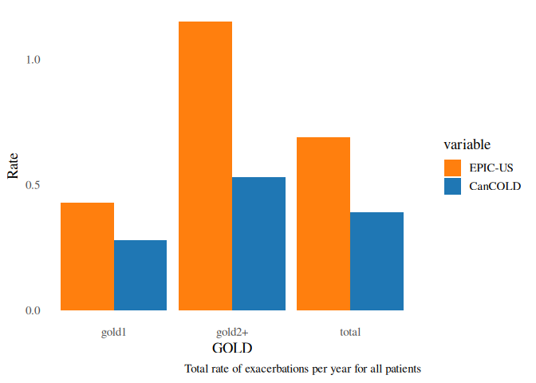
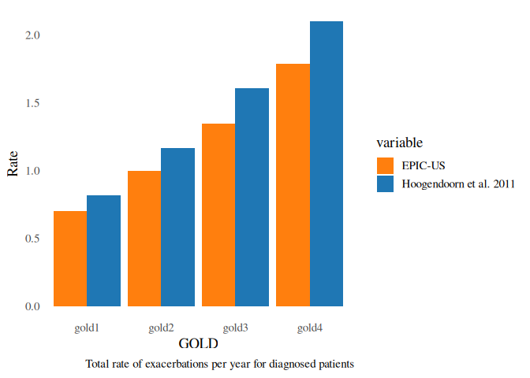
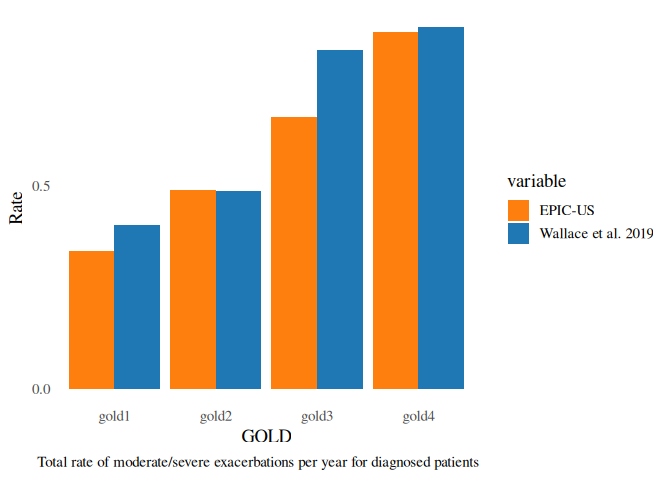
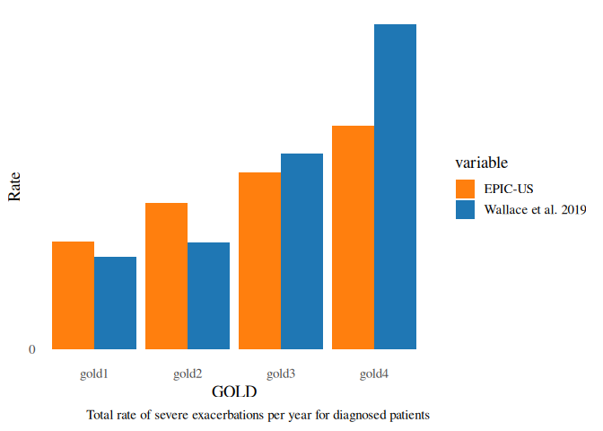
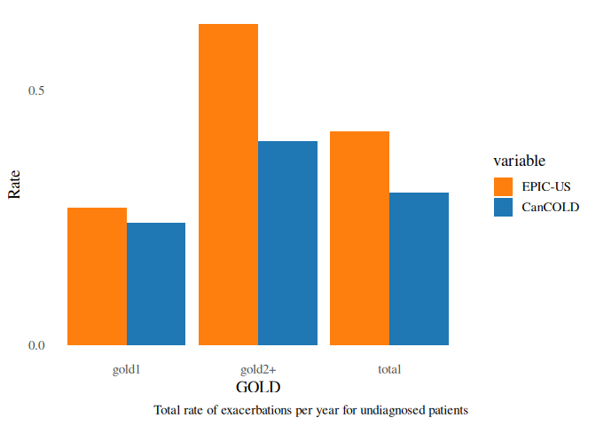

Exacerbations Module
================

## Overview

This document outlines the calibration process undertaken to align the
model’s outputs with validation targets for COPD exacerbations, using
Wallace et al. 2019, Hoogendoorn et al. 2011, and CanCOLD.

## Calibration of COPD Exacerbation Rates

This section outlines the internal validation process conducted to align
the model’s simulated COPD exacerbation rates with empirical targets
drawn from key reference studies. The validation focused on both
diagnosed and undiagnosed populations and was stratified by GOLD stage
and exacerbation severity (total, moderate/severe, and severe only).
Detailed validation targets and associated calibration code are
presented below.

**Validation References:**

- Ford et al. 2015 (DOI: 10.1378/chest.14-2146)
- Hoogendoorn et al. 2011 (DOI: 10.1183/09031936.00043710)
- Wallace et al. 2019 (DOI: 10.18553/jmcp.2019.25.2.205)
- CanCOLD study (DOI: 10.3109/15412555.2012.665520)

------------------------------------------------------------------------

## **Validation Targets**

### **Total Rate of Exacerbation per 100,000 Individuals (Ford et al. 2015)**

Ford et al. 2015 reported age-specific hospitalization rates for COPD
but did not provide an aggregated rate for adults aged \>40 years. As
such this estimate was not available, a combined rate was derived as the
best available evidence for a population-level measure of COPD-related
hospitalizations per 100,000 individuals in this age group.

To calculate this estimate, age-specific hospitalization rates reported
in Table 1 of Ford et al. 2015 and were weighted by the U.S. Census
population counts for 2012. Rates reported in Table 1 per 100,000 were
276.9 for ages 45–64, 939.4 for ages 65–84, and 1,181.2 for ages ≥85.
Each rate was multiplied by the corresponding population size from the
U.S. Census population numbers for 2012 (81.5 million, 35.0 million, and
5.9 million, respectively) to obtain the expected number of
hospitalizations within each strata. These values were summed and
divided by the total population aged \>40 years (122.4 million), then
scaled per 100,000. The resulting combined hospitalization rate was
approximately 510 per 100,000 individuals aged \>40 years in 2012.

- **Total Exacerbation Rate:** 510 per 100,000 individuals

### **Diagnosed Patients – Total Exacerbation Rate (Hoogendoorn et al. 2011)**

Simulated rates were compared against those reported by Hoogendoorn et
al. 2011: - **GOLD 1:** 0.82  
- **GOLD 2:** 1.17  
- **GOLD 3:** 1.61  
- **GOLD 4:** 2.10

### **Diagnosed Patients – Moderate and Severe Exacerbation Rates (Wallace et al. 2019 Study)**

Wallace et al. 2019 provided target rates for moderate and severe
exacerbations: - **GOLD 1:** 0.404 - **GOLD 2:** 0.489  
- **GOLD 3:** 0.836 - **GOLD 4:** 0.891

### **Diagnosed Patients – Severe Exacerbation Rates** (Wallace et al. 2019 Study)

Wallace et al. 2019 provided target rates for severe exacerbations: -
**GOLD 1:** 0.12 - **GOLD 2:** 0.139  
- **GOLD 3:** 0.254  
- **GOLD 4:** 0.422

### **Undiagnosed Patients – Total Exacerbation Rate (CanCOLD)**

For the undiagnosed subgroup, exacerbation rates were benchmarked
against CanCOLD data: - **Total population:** 0.30  
- **GOLD 1:** 0.24  
- **GOLD 2+:** 0.40

### **Overall and GOLD-Stratified Total Exacerbation Rates (CanCOLD)**

For all individuals (diagnosed and undiagnosed), total exacerbation
rates per year were compared against the CanCOLD study benchmarks: -
**Total population:** 0.39  
- **GOLD 1:** 0.28  
- **GOLD 2+:** 0.53

------------------------------------------------------------------------

The calibration code below performs the relevant calculations and
visualizations for each validation target.

## Load Libraries and Setup

``` r
library(tidyverse)
```

    ## ── Attaching core tidyverse packages ──────────────────────── tidyverse 2.0.0 ──
    ## ✔ dplyr     1.2.0     ✔ readr     2.2.0
    ## ✔ forcats   1.0.1     ✔ stringr   1.6.0
    ## ✔ ggplot2   4.0.2     ✔ tibble    3.3.1
    ## ✔ lubridate 1.9.5     ✔ tidyr     1.3.2
    ## ✔ purrr     1.2.1     
    ## ── Conflicts ────────────────────────────────────────── tidyverse_conflicts() ──
    ## ✖ dplyr::filter() masks stats::filter()
    ## ✖ dplyr::lag()    masks stats::lag()
    ## ℹ Use the conflicted package (<http://conflicted.r-lib.org/>) to force all conflicts to become errors

``` r
library(epicUS)
library(ggthemes)
library(scales)
```

    ## 
    ## Attaching package: 'scales'
    ## 
    ## The following object is masked from 'package:purrr':
    ## 
    ##     discard
    ## 
    ## The following object is masked from 'package:readr':
    ## 
    ##     col_factor

``` r
library(ggplot2)
library(dplyr)
library(tidyr)
library(reshape2)
```

    ## 
    ## Attaching package: 'reshape2'
    ## 
    ## The following object is masked from 'package:tidyr':
    ## 
    ##     smiths

``` r
# Load EPIC-US general settings
settings <- get_default_settings()
settings$record_mode <- 2
settings$n_base_agents <- 3.5e6
init_session(settings = settings)
```

    ## Initializing the session

    ## [1] 0

``` r
input <- get_input()
time_horizon <- 46

# Load EPIC-US general settings
run(input = input$values)
```

    ## ERROR:ERR_EVENT_STACK_FULL

    ## [1] -4

``` r
op <- Cget_output()
output_ex <- Cget_output_ex()
```

## Create Data Tables by Types of Exacerbations

``` r
# Plot colours
validation_colors <- c(
  "EPIC-US"         = "#ff7f0e",  # Orange
  "CanCOLD"      = "#1f77b4",  # Blue
  "Hoogendoorn et al. 2011"  = "#1f77b4",  # Blue
  "Wallace et al. 2019" = "#1f77b4"   # Blue
)

all_events <- as.data.frame(Cget_all_events_matrix())
exac_events <- subset(all_events, event == 5)
exit_events <- subset(all_events, event == 14)

Follow_up_GOLD <- c(0, 0, 0, 0)
last_GOLD_transition_time <- 0
for (i in 2:dim(all_events)[1]) {
  if (all_events[i, "id"] != all_events[i - 1, "id"])
    last_GOLD_transition_time <- 0
  if ((all_events[i, "id"] == all_events[i - 1, "id"]) & (all_events[i, "gold"] != all_events[i - 1, "gold"])) {
    Follow_up_GOLD[all_events[i - 1, "gold"]] = Follow_up_GOLD[all_events[i - 1, "gold"]] + all_events[i - 1, "followup_after_COPD"] -
      last_GOLD_transition_time
    last_GOLD_transition_time <- all_events[i - 1, "followup_after_COPD"]
  }
  if (all_events[i, "event"] == 14)
    Follow_up_GOLD[all_events[i, "gold"]] = Follow_up_GOLD[all_events[i, "gold"]] + all_events[i, "followup_after_COPD"] -
      last_GOLD_transition_time
}


#----------------------------DIAGNOSED ------------------------------------
#-------------------------------------------------------------------------

all_events_diagnosed          <- subset(all_events, diagnosis > 0 & gold > 0 )
exac_events_diagnosed         <- subset(all_events_diagnosed, event == 5 )
sev_exac_events_diagnosed    <- subset(all_events_diagnosed, event == 5 & (exac_status == 3 | exac_status == 4) )
mod_sev_exac_events_diagnosed <- subset(all_events_diagnosed, event == 5 & (exac_status == 3 | exac_status == 4 | exac_status == 2) )
exit_events_diagnosed         <- subset(all_events_diagnosed, event == 14)

Follow_up_GOLD_diagnosed <- c(0, 0, 0, 0)
last_GOLD_transition_time_diagnosed <- 0
for (i in 2:dim(all_events_diagnosed)[1]) {
  if ((all_events_diagnosed[i, "id"] != all_events_diagnosed[i - 1, "id"]))
    last_GOLD_transition_time_diagnosed <- 0
  if ((all_events_diagnosed[i, "id"] == all_events_diagnosed[i - 1, "id"]) & (all_events_diagnosed[i, "gold"] != all_events_diagnosed[i - 1, "gold"])) {
    Follow_up_GOLD_diagnosed[all_events_diagnosed[i - 1, "gold"]] = Follow_up_GOLD_diagnosed[all_events_diagnosed[i - 1, "gold"]] + (all_events_diagnosed[i - 1, "local_time"]-all_events_diagnosed[i - 1, "time_at_diagnosis"]) -
      last_GOLD_transition_time_diagnosed
    last_GOLD_transition_time_diagnosed <- (all_events_diagnosed[i - 1, "local_time"]-all_events_diagnosed[i - 1, "time_at_diagnosis"])
  }
  if (all_events_diagnosed[i, "event"] == 14)
    Follow_up_GOLD_diagnosed[all_events_diagnosed[i, "gold"]] = Follow_up_GOLD_diagnosed[all_events_diagnosed[i, "gold"]] + (all_events_diagnosed[i, "local_time"]-all_events_diagnosed[i, "time_at_diagnosis"]) -
      last_GOLD_transition_time_diagnosed
}

#----------------------------UNDIAGNOSED ------------------------------------
#-------------------------------------------------------------------------

all_events_undiagnosed          <- subset(all_events, diagnosis == 0 & gold > 0 & gold < 3) #CanCOLD is only GOLD 1 and 2
exac_events_undiagnosed         <- subset(all_events_undiagnosed, event == 5 )
sev_exac_events_undiagnosed     <- subset(all_events_undiagnosed, event == 5 & (exac_status == 3 | exac_status == 4) )
mod_sev_exac_events_undiagnosed <- subset(all_events_undiagnosed, event == 5 & (exac_status == 3 | exac_status == 4 | exac_status == 2) )
exit_events_undiagnosed         <- subset(all_events_undiagnosed, event == 14)

Follow_up_GOLD_undiagnosed <- c(0, 0, 0, 0)
last_GOLD_transition_time_undiagnosed <- 0
for (i in 2:dim(all_events_undiagnosed)[1]) {
  if ((all_events_undiagnosed[i, "id"] != all_events_undiagnosed[i - 1, "id"]))
    last_GOLD_transition_time_undiagnosed <- 0
  if ((all_events_undiagnosed[i, "id"] == all_events_undiagnosed[i - 1, "id"]) & (all_events_undiagnosed[i, "gold"] != all_events_undiagnosed[i - 1, "gold"])) {
    Follow_up_GOLD_undiagnosed[all_events_undiagnosed[i - 1, "gold"]] = Follow_up_GOLD_undiagnosed[all_events_undiagnosed[i - 1, "gold"]] + (all_events_undiagnosed[i - 1, "local_time"]-all_events_undiagnosed[i - 1, "time_at_diagnosis"]) -
      last_GOLD_transition_time_undiagnosed
    last_GOLD_transition_time_undiagnosed <- (all_events_undiagnosed[i - 1, "local_time"]-all_events_undiagnosed[i - 1, "time_at_diagnosis"])
  }
  if (all_events_undiagnosed[i, "event"] == 14)
    Follow_up_GOLD_undiagnosed[all_events_undiagnosed[i, "gold"]] = Follow_up_GOLD_undiagnosed[all_events_undiagnosed[i, "gold"]] + (all_events_undiagnosed[i, "local_time"]-all_events_undiagnosed[i, "time_at_diagnosis"]) -
      last_GOLD_transition_time_undiagnosed
}

terminate_session()
```

    ## Terminating the session

    ## [1] 0

``` r
#----------------------------All ------------------------------------
#-------------------------------------------------------------------------

message("Exacerbation Rates per GOLD stages for all patients:")
```

    ## Exacerbation Rates per GOLD stages for all patients:

``` r
GOLD_I   <- (as.data.frame(table(exac_events[, "gold"]))[1, 2]/Follow_up_GOLD[1])
GOLD_II  <- (as.data.frame(table(exac_events[, "gold"]))[2, 2]/Follow_up_GOLD[2])
GOLD_III <- (as.data.frame(table(exac_events[, "gold"]))[3, 2]/Follow_up_GOLD[3])
GOLD_IV  <- (as.data.frame(table(exac_events[, "gold"]))[4, 2]/Follow_up_GOLD[4])

message(paste0("exacRateGOLDI   = ", round(GOLD_I  , 2)))
```

    ## exacRateGOLDI   = 0.43

``` r
message(paste0("exacRateGOLDII  = ", round(GOLD_II , 2)))
```

    ## exacRateGOLDII  = 0.73

``` r
message(paste0("exacRateGOLDIII = ", round(GOLD_III, 2)))
```

    ## exacRateGOLDIII = 1.15

``` r
message(paste0("exacRateGOLDIV  = ", round(GOLD_IV , 2)))
```

    ## exacRateGOLDIV  = 1.51

``` r
#----------------------------All ------------------------------------
#-------------------------------------------------------------------------
total_rate <- round(nrow(exac_events)/sum(Follow_up_GOLD), 2)
Exac_per_GOLD <- matrix (NA, nrow = 3, ncol =3)
colnames(Exac_per_GOLD) <- c("GOLD", "EPIC-US", "CanCOLD")
# CanCOLD only available for GOLD 1 and 2. See doi: 10.1164/rccm.201509-1795OC

Follow_up_GOLD_all_2level <- c(Follow_up_GOLD[1], Follow_up_GOLD[2]) # Because CanCOLD is mostly GOLD2, here we compare EPIC's GOLD2 only instead of GOLD2+
#  Follow_up_GOLD_all_2level <- c(Follow_up_GOLD[1], sum(Follow_up_GOLD[2:4]))
GOLD_counts_all       <- as.data.frame(table(exac_events[, "gold"]))[, 2]
GOLD_counts_all       <- c(GOLD_counts_all[1], sum(GOLD_counts_all[2:4]))

Exac_per_GOLD[1:3, 1] <- c("total", "gold1", "gold2+")
Exac_per_GOLD[1:3, 2] <- c(total_rate,
                           round(x=GOLD_counts_all/Follow_up_GOLD_all_2level,
                                 digit = 2))
Exac_per_GOLD[1:3, 3] <- c(0.39, 0.28, 0.53)

df <- as.data.frame(Exac_per_GOLD)
dfm <- melt(df[,c("GOLD", "EPIC-US", "CanCOLD")],id.vars = 1)
plot <-
  ggplot(dfm, aes(x = GOLD, y = as.numeric(value))) +
  scale_y_continuous(breaks = seq(0, 3, by = 0.5)) +
  scale_fill_manual(values = validation_colors) +  # <--- Added Custom Colors
  theme_tufte(base_size=14, ticks=F)  +
  geom_bar(aes(fill = variable), stat = "identity", position = "dodge") +
  ylab ("Rate") +
  labs(caption = "Total rate of exacerbations per year for all patients")

print(plot)
```

<!-- -->

``` r
#----------------------------Diagnosed ------------------------------------
#-------------------------------------------------------------------------

Exac_per_GOLD_diagnosed <- matrix (NA, nrow = 4, ncol = 3)
colnames(Exac_per_GOLD_diagnosed) <- c("GOLD", "EPIC-US", "Hoogendoorn et al. 2011")

Exac_per_GOLD_diagnosed[1:4, 1] <- c("gold1", "gold2", "gold3", "gold4")
Exac_per_GOLD_diagnosed[1:4, 2] <- round(
  x=as.data.frame(table(exac_events_diagnosed[, "gold"]))[, 2]/
    Follow_up_GOLD_diagnosed, digit = 2)
Exac_per_GOLD_diagnosed[1:4, 3] <- c(0.82, 1.17, 1.61, 2.10)

df <- as.data.frame(Exac_per_GOLD_diagnosed)
dfm <- melt(df[,c("GOLD", "EPIC-US", "Hoogendoorn et al. 2011")],id.vars = 1)
plot <- ggplot(dfm, aes(x = GOLD, y = as.numeric(value))) +
  scale_y_continuous(breaks = seq(0, 3, by = 0.5)) +
  scale_fill_manual(values = validation_colors) +  # <--- Added Custom Colors
  theme_tufte(base_size=14, ticks=F)  +
  geom_bar(aes(fill = variable), stat = "identity", position = "dodge") +
  ylab ("Rate") +
  labs(caption = "Total rate of exacerbations per year for diagnosed patients")
print(plot)
```

<!-- -->

``` r
message("Total rate of exacerbation in diagnosed patients (1.5 per year in Hoogendoorn): ", round(nrow(exac_events_diagnosed)/sum(Follow_up_GOLD_diagnosed), 2))
```

    ## Total rate of exacerbation in diagnosed patients (1.5 per year in Hoogendoorn): 1.03

## Visualize Exacerbation Rates in EPIC-US compared to Validation Targets

``` r
#----------------------------Diagnosed Moderate and Severe------------------------------------
#-------------------------------------------------------------------------

Exac_per_GOLD_diagnosed <- matrix (NA, nrow = 4, ncol = 3)
colnames(Exac_per_GOLD_diagnosed) <- c("GOLD", "EPIC-US", "Wallace et al. 2019")

Exac_per_GOLD_diagnosed[1:4, 1] <- c("gold1", "gold2", "gold3", "gold4")
Exac_per_GOLD_diagnosed[1:4, 2] <- round(
  x=as.data.frame(table(mod_sev_exac_events_diagnosed[, "gold"]))[, 2]/
    Follow_up_GOLD_diagnosed, digit = 2)
Exac_per_GOLD_diagnosed[1:4, 3] <- c(0.404, 0.489, 0.836, 0.891)

df <- as.data.frame(Exac_per_GOLD_diagnosed)
dfm <- melt(df[,c("GOLD", "EPIC-US", "Wallace et al. 2019")],id.vars = 1)
plot <-
  ggplot(dfm, aes(x = GOLD, y = as.numeric(value))) +
  scale_y_continuous(breaks = seq(0, 3, by = 0.5)) +
  scale_fill_manual(values = validation_colors) + 
  theme_tufte(base_size=14, ticks=F)  +
  geom_bar(aes(fill = variable), stat = "identity", position = "dodge") +
  ylab ("Rate") +
  labs(caption = "Total rate of moderate/severe exacerbations per year for diagnosed patients")

print(plot)
```

<!-- -->

``` r
#----------------------------Diagnosed Severe------------------------------------
#-------------------------------------------------------------------------

Exac_per_GOLD_diagnosed <- matrix (NA, nrow = 4, ncol = 3)
colnames(Exac_per_GOLD_diagnosed) <- c("GOLD", "EPIC-US", "Wallace et al. 2019")

Exac_per_GOLD_diagnosed[1:4, 1] <- c("gold1", "gold2", "gold3", "gold4")
Exac_per_GOLD_diagnosed[1:4, 2] <- round(
  x=as.data.frame(table(sev_exac_events_diagnosed[, "gold"]))[, 2]/
    Follow_up_GOLD_diagnosed, digit = 2)
Exac_per_GOLD_diagnosed[1:4, 3] <- c(0.12, 0.139, 0.254, 0.422)

df <- as.data.frame(Exac_per_GOLD_diagnosed)
dfm <- melt(df[,c("GOLD", "EPIC-US", "Wallace et al. 2019")],id.vars = 1)
plot <-
  ggplot(dfm, aes(x = GOLD, y = as.numeric(value))) +
  scale_y_continuous(breaks = seq(0, 3, by = 0.5)) +
  scale_fill_manual(values = validation_colors) +
  theme_tufte(base_size=14, ticks=F)  +
  geom_bar(aes(fill = variable), stat = "identity", position = "dodge") +
  ylab ("Rate") +
  labs(caption = "Total rate of severe exacerbations per year for diagnosed patients")

print(plot)
```

<!-- -->

``` r
#----------------------------Undiagnosed ------------------------------------
#----------------------------------------------------------------------------
total_rate_undiagnosed <- round(nrow(exac_events_undiagnosed)/sum(Follow_up_GOLD_undiagnosed), 2)
Exac_per_GOLD_undiagnosed <- matrix (NA, nrow = 3, ncol = 3)
colnames(Exac_per_GOLD_undiagnosed) <- c("GOLD", "EPIC-US", "CanCOLD")
Exac_per_GOLD_undiagnosed[1:3, 1] <- c("total", "gold1", "gold2+")

Follow_up_GOLD_undiagnosed_2level <- c(Follow_up_GOLD_undiagnosed[1],
                                       Follow_up_GOLD_undiagnosed[2]) #Because CANCold is mostly GOLD2, we comprare to GOLD2 EPIC
#Follow_up_GOLD_undiagnosed_2level <- c(Follow_up_GOLD_undiagnosed[1], sum(Follow_up_GOLD_undiagnosed[2:4]))
GOLD_counts_undiagnosed   <- as.data.frame(table(exac_events_undiagnosed[, "gold"]))[, 2]
GOLD_counts_undiagnosed   <- c(GOLD_counts_undiagnosed[1],
                               GOLD_counts_undiagnosed[2])


Exac_per_GOLD_undiagnosed[1:3, 2] <- c(total_rate_undiagnosed,
                                       round(x=GOLD_counts_undiagnosed/Follow_up_GOLD_undiagnosed_2level, digit = 2))
Exac_per_GOLD_undiagnosed[1:3, 3] <- c(0.30, 0.24, 0.40)

df <- as.data.frame(Exac_per_GOLD_undiagnosed)
dfm <- melt(df[,c("GOLD", "EPIC-US", "CanCOLD")],id.vars = 1)
plot <-
  ggplot(dfm, aes(x = GOLD, y = as.numeric(value))) +
  scale_y_continuous(breaks = seq(0, 3, by = 0.5)) +
  scale_fill_manual(values = validation_colors) +  # <--- Added Custom Colors
  theme_tufte(base_size=14, ticks=F)  +
  geom_bar(aes(fill = variable), stat = "identity", position = "dodge") +
  ylab ("Rate") +
  labs(caption = "Total rate of exacerbations per year for undiagnosed patients")
print(plot)
```

<!-- -->

``` r
message("Total rate of exacerbation in undiagnosed patients (0.30 per year in CanCOLD): ",
        total_rate_undiagnosed)
```

    ## Total rate of exacerbation in undiagnosed patients (0.30 per year in CanCOLD): 0.42
