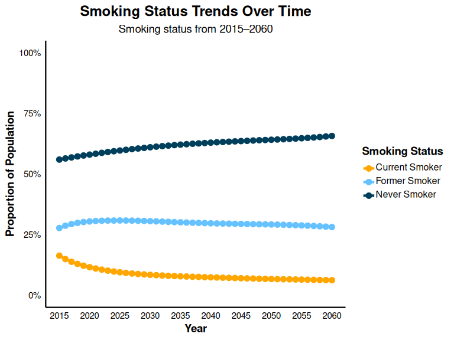
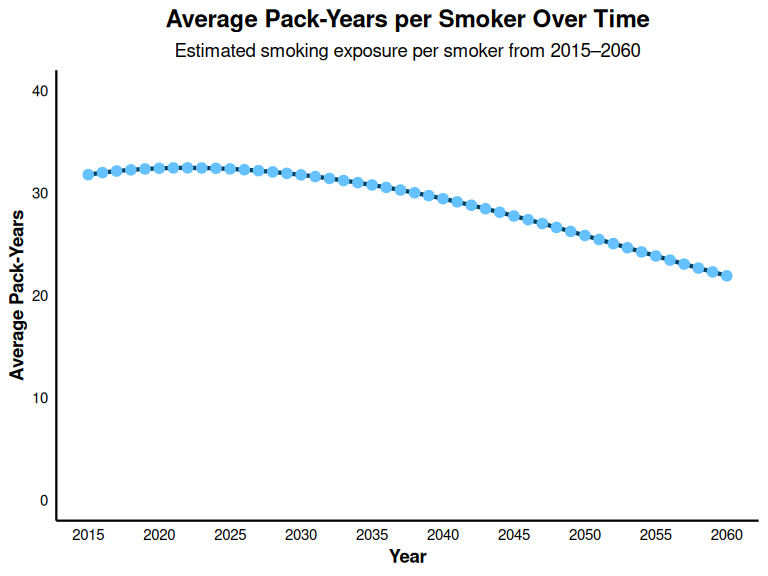

Smoking Module
================

## Overview

This document outlines the steps taken to calibrate the model to align
with U.S.-based validation targets for smoking behavior using a 45 year
time horizon.

Smoking behavior data from the U.S. National Health Interview Survey for
the years 2018 and 2023 were used as validation targets.

Data from the 2018 U.S. National Health Interview Survey Table A-12b
(<https://archive.cdc.gov/www_cdc_gov/nchs/nhis/shs/tables.htm>) were
used to calculate the proportion of current, former, and non-smokers
among adults aged 45 and over. Population counts were summed for age
groups 45–64, 65–74, and 75+, yielding a total of 134,448 individuals.
Of these, 13.2% were identified as current smokers (n=17,797), 29.3% as
former smokers (n=39,351), and 57.5% as non-smokers (n=76,873). While
the EPIC model simulates individuals aged 40 and older, the survey data
were not stratified using a 40+ grouping; therefore, individuals aged 45
and over were used as an appropriate proxy for model validation.

To estimate the number and proportion of current exclusive cigarette
smokers among U.S. adults aged 45 and over in 2023, data from a 2025
MMWR report based on the National Health Interview Survey (DOI:
10.15585/mmwr.mm7407a3) were referenced. The estimated number of
exclusive cigarette smokers in 2023 was 8.77 million for adults aged
45–64 and 4.20 million for those aged 65 and older. Using the reported
prevalence rates—11.2% for ages 45–64 and 7.5% for ages 65 and
older—population denominators were back-calculated by dividing the
number of smokers by their respective prevalence estimates. This
resulted in an estimated population of 78.3 million adults aged 45–64
and 56.0 million aged 65 and older, totaling approximately 134.3 million
adults aged 45 and over. As with the 2018 data, the absence of a 40+ age
grouping required the use of 45 and over as a surrogate, resulting in an
estimated smoking prevalence of 9.7% (12.97 million of 134.3 million).

To project the future decline in the prevalence of cigarette smoking
among U.S. adults aged 40 and over after 2023, historical data from the
2025 MMWR report (DOI: 10.15585/mmwr.mm7407a3) was used. In 2017, the
number of exclusive cigarette smokers was estimated at 11.0 million for
adults aged 45–64 and 3.57 million for those aged 65 and older, totaling
14.57 million. By 2023, these figures declined to 8.77 million and 4.20
million, respectively, resulting in a combined total of 12.97 million
smokers aged 45 and over. The AAPC was calculated using the formula:
AAPC = ((Value 2023 / Value 2017) ^ (1/6)) - 1. This resulted in an
estimated AAPC of –1.9% per year. This historical trend was then applied
to model the projected year-over-year decline in smoking prevalence
beyond 2023.

To estimate pack-years per ever-smoker data from the Population
Assessment of Tobacco and Health (PATH) study was used which reported an
average of 32.9 pack-years among ever smokers in 2018 (DOI:
10.18332/tid/204009).

**Summary of validation targets:**  
- **Current smokers (2018):** 13.2%  
- **Former smokers (2018):** 29.3%  
- **Never smokers (2018):** 57.5%  
- **Current smokers (2023):** 9.7%  
- **AAPC after 2023:** –1.9% per year  
- **Pack-years for ever-smokers (2018):** 32.9

EPIC-US’s existing function (from EPIC Canada) underestimated the
proportions of never and former smokers compared to the 2018 Summary
Health Statistics: National Health Interview Survey (NHIS). To address
this, the intercepts that determines the probability of being a never
smoker and the probability of being a smoker at time of creation in the
logistic regression equation were re-calibrated.

## Load Libraries and Setup

Here, the necessary libraries are loaded. The simulation settings is set
and the time horizon specified for the simulation is 45 years.

``` r
library(epicUS)
library(tidyverse)
library(ggplot2)
library(scales)
library(dplyr)
library(knitr)

# Load EPIC general settings
settings <- get_default_settings()
settings$record_mode <- 0
settings$n_base_agents <- 1e6
init_session(settings = settings)
```

    ## [1] 0

``` r
input <- get_input()
time_horizon <- 46
input$values$global_parameters$time_horizon <- time_horizon

run(input = input$values)
```

    ## [1] 0

``` r
output <- Cget_output_ex()
terminate_session()
```

    ## [1] 0

## Create data tables

``` r
#Calculate smoking proportions
smokingstatus_overall <- output$n_smoking_status_by_ctime
row_sums <- rowSums(smokingstatus_overall)
smokingstatus_proportions <- smokingstatus_overall / row_sums
smokingstatus_proportions <- as.data.frame(smokingstatus_proportions)

# Rename columns for readability
colnames(smokingstatus_proportions) <- c("Never Smoker", "Current Smoker", "Former Smoker")

# Add Year column
smokingstatus_proportions$Year <- 2015:2060

# Display summary of smoking status 
kable(
  smokingstatus_proportions[, c("Year", "Never Smoker", "Current Smoker", "Former Smoker")],
  caption = "Proportion of Smoking Status Over Time",
  digits = 3
  )
```

| Year | Never Smoker | Current Smoker | Former Smoker |
|-----:|-------------:|---------------:|--------------:|
| 2015 |        0.560 |          0.163 |         0.277 |
| 2016 |        0.564 |          0.149 |         0.287 |
| 2017 |        0.568 |          0.138 |         0.294 |
| 2018 |        0.572 |          0.129 |         0.298 |
| 2019 |        0.576 |          0.122 |         0.302 |
| 2020 |        0.580 |          0.116 |         0.304 |
| 2021 |        0.584 |          0.110 |         0.306 |
| 2022 |        0.587 |          0.106 |         0.307 |
| 2023 |        0.591 |          0.101 |         0.308 |
| 2024 |        0.594 |          0.098 |         0.308 |
| 2025 |        0.597 |          0.095 |         0.308 |
| 2026 |        0.600 |          0.092 |         0.308 |
| 2027 |        0.603 |          0.090 |         0.308 |
| 2028 |        0.605 |          0.088 |         0.307 |
| 2029 |        0.608 |          0.086 |         0.306 |
| 2030 |        0.610 |          0.084 |         0.306 |
| 2031 |        0.613 |          0.083 |         0.305 |
| 2032 |        0.615 |          0.081 |         0.304 |
| 2033 |        0.617 |          0.080 |         0.303 |
| 2034 |        0.619 |          0.079 |         0.302 |
| 2035 |        0.621 |          0.078 |         0.301 |
| 2036 |        0.623 |          0.077 |         0.300 |
| 2037 |        0.625 |          0.076 |         0.299 |
| 2038 |        0.626 |          0.076 |         0.298 |
| 2039 |        0.628 |          0.075 |         0.298 |
| 2040 |        0.629 |          0.074 |         0.297 |
| 2041 |        0.631 |          0.073 |         0.296 |
| 2042 |        0.632 |          0.072 |         0.296 |
| 2043 |        0.633 |          0.072 |         0.295 |
| 2044 |        0.635 |          0.071 |         0.295 |
| 2045 |        0.636 |          0.070 |         0.294 |
| 2046 |        0.637 |          0.069 |         0.294 |
| 2047 |        0.638 |          0.069 |         0.293 |
| 2048 |        0.639 |          0.068 |         0.293 |
| 2049 |        0.640 |          0.067 |         0.292 |
| 2050 |        0.641 |          0.067 |         0.292 |
| 2051 |        0.642 |          0.066 |         0.291 |
| 2052 |        0.643 |          0.066 |         0.291 |
| 2053 |        0.645 |          0.066 |         0.290 |
| 2054 |        0.646 |          0.065 |         0.289 |
| 2055 |        0.648 |          0.065 |         0.288 |
| 2056 |        0.649 |          0.064 |         0.287 |
| 2057 |        0.651 |          0.064 |         0.286 |
| 2058 |        0.653 |          0.063 |         0.284 |
| 2059 |        0.655 |          0.062 |         0.283 |
| 2060 |        0.657 |          0.062 |         0.281 |

Proportion of Smoking Status Over Time

## Visualize Smoking Status Trends

``` r
# Reshape data for plotting
smokingstatus_reshaped<- pivot_longer(
  smokingstatus_proportions,
  cols = c("Never Smoker", "Current Smoker", "Former Smoker"),
  names_to = "Status",
  values_to = "Proportion"
  )

# Define colors
poster_colors <- c(
  "Never Smoker" = "#003f5c",      
  "Current Smoker" = "#ffa600",   
  "Former Smoker" = "#66c2ff"      
  )

# Plot smoking status trends
ggplot(smokingstatus_reshaped, aes(x = Year, y = Proportion, color = Status)) +
  geom_line(linewidth = 1.5) +
  geom_point(size = 3) +
  scale_color_manual(values = poster_colors) +
  scale_y_continuous(labels = percent_format(accuracy = 1), limits = c(0, 1)) +
  scale_x_continuous(breaks = seq(2015, 2060, by = 5)) +
  labs(
    title = "Smoking Status Trends Over Time",
    subtitle = "Smoking status from 2015–2060",
    x = "Year",
    y = "Proportion of Population",
    color = "Smoking Status"
    ) +
  theme_minimal(base_size = 14) +
  theme(
    plot.title = element_text(face = "bold", size = 18, hjust = 0.5),
    plot.subtitle = element_text(size = 14, hjust = 0.5),
    axis.title = element_text(face = "bold"),
    axis.text = element_text(color = "black"),
    axis.line = element_line(color = "black", linewidth = 0.8),
    panel.grid.major = element_blank(),
    panel.grid.minor = element_blank(),
    legend.title = element_text(face = "bold"),
    legend.text = element_text(size = 12, margin = margin(b = 4)),
    legend.key.height = unit(1.2, "lines")
    )
```

<!-- -->

## Observe Trend in Pack-years Per Person

This figure serves to assess the face validity of the simulated
trajectory of average pack-years per smoker over time. Due to the
absence of nationally representative longitudinal data on cumulative
smoking exposure (pack-years) in the United States, trends in smoking
intensity was used to estimate the impact on pack-years.

Evidence from Cornelius et al. 2022 published in the CDC’s Morbidity and
Mortality Weekly Report (DOI: 10.15585/mmwr.mm7111a1) highlights a
sustained decline in cigarette consumption among daily smokers between
2005 and 2020. During this period:

The proportion of adults reporting consumption of 20–29 cigarettes/day
decreased from 34.9% to 27.9% Those smoking ≥30 cigarettes/day declined
from 12.7% to 6.4% Conversely, the percentage smoking 1–9 cigarettes/day
increased from 16.4% to 25.0% Those smoking 10–19 cigarettes/day rose
from 36.0% to 40.7%

These data reflect a broader shift toward lower daily cigarette
consumption, suggesting that, on average, smokers are now consuming
approximately half to one pack per day. In light of this, a projected
decline in cumulative pack-year exposure is both expected and
reasonable. The observed decrease in average pack-years per smoker in
the model is therefore aligned with empirically documented reductions in
smoking intensity, supporting the face validity of the simulated trend.

``` r
# Calculate total pack years by year
pack_years_total<- as.data.frame(output$sum_pack_years_by_ctime_sex)
pack_years_total <- rowSums(pack_years_total)
pack_years_total <- data.frame(
  Year = 2015:2060,
  packyears = pack_years_total)

# Calculate total number of current and former smokers by year

smoking_history <- as.data.frame(output$n_smoking_status_by_ctime)
smoking_history <- rowSums(smoking_history [, 2:3])
smoking_history <- data.frame(
    Year = 2015:2060,
    n_smokers = smoking_history)

# Merge datasets by year
pack_years_total_and_smoking_history <- merge(pack_years_total, smoking_history, by = "Year")

# Calculate average pack-years 
pack_year_per_person <- data.frame(
  Year = pack_years_total_and_smoking_history$Year,
  AvgPackYearsPerSmoker = pack_years_total_and_smoking_history$packyears / pack_years_total_and_smoking_history$n_smokers
  )

#
```

## Visualize Trend in Pack-years Per Person

``` r
ggplot(pack_year_per_person, aes(x = Year, y = AvgPackYearsPerSmoker)) +
  geom_line(linewidth = 1.5, color = "#003f5c") +           
  geom_point(size = 3, color = "#66c2ff", stroke = 0.8) +  
  scale_y_continuous(
    labels = scales::comma_format(accuracy = 1),
    limits = c(0, 40)
    ) +
  scale_x_continuous(breaks = seq(2015, 2060, by = 5)) +
  labs(
    title = "Average Pack-Years per Smoker Over Time",
    subtitle = "Estimated smoking exposure per smoker from 2015–2060",
    x = "Year",
    y = "Average Pack-Years"
    ) +
  theme_minimal(base_size = 14) +
  theme(
    plot.title = element_text(face = "bold", size = 18, hjust = 0.5, margin = margin(b = 8)),
    plot.subtitle = element_text(size = 14, hjust = 0.5),
    axis.title = element_text(face = "bold"),
    axis.text = element_text(color = "black"),
    axis.line = element_line(color = "black", linewidth = 0.8),
    panel.grid.major = element_blank(),
    panel.grid.minor = element_blank()
    )
```

<!-- -->

### 
